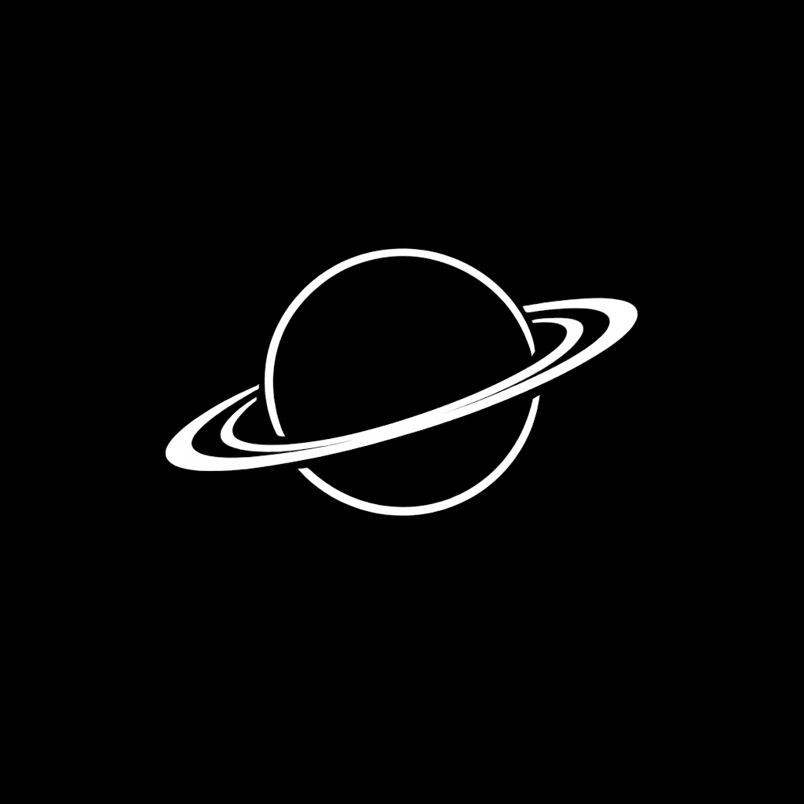
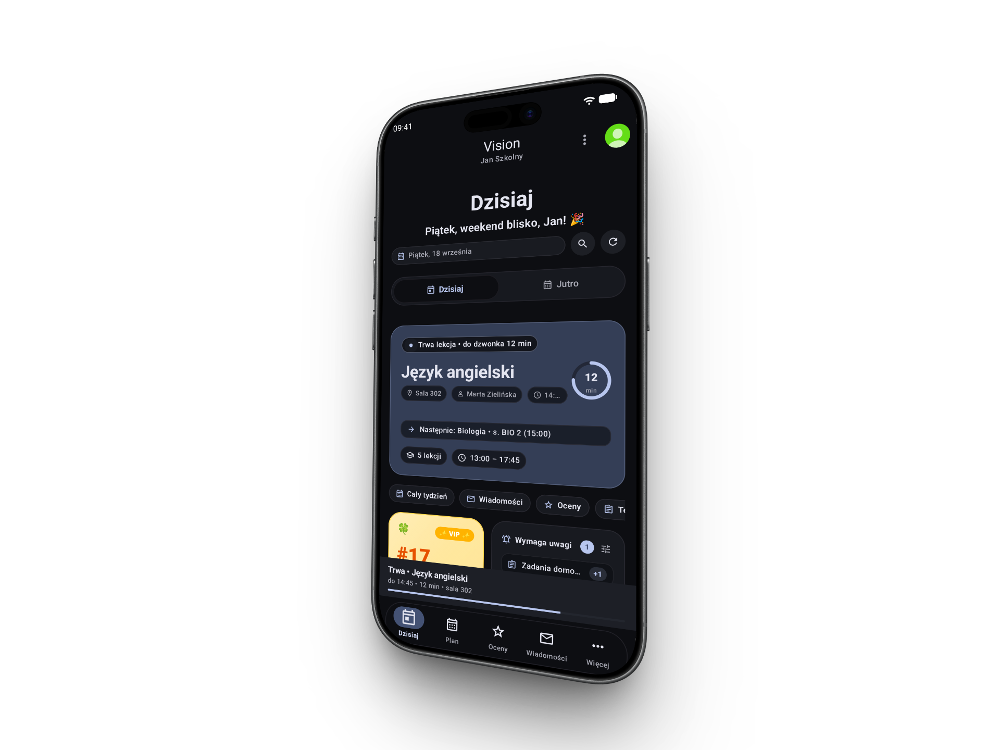
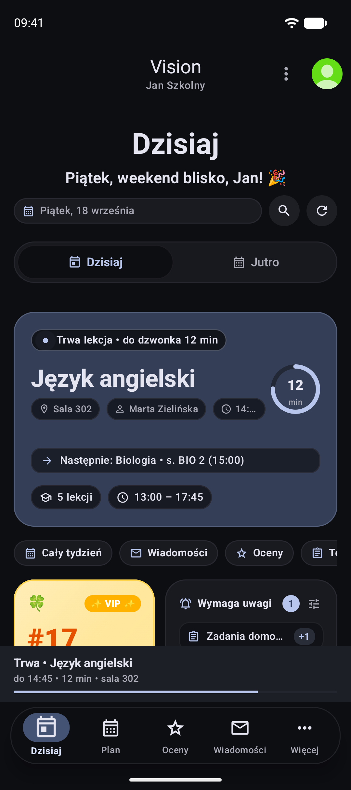
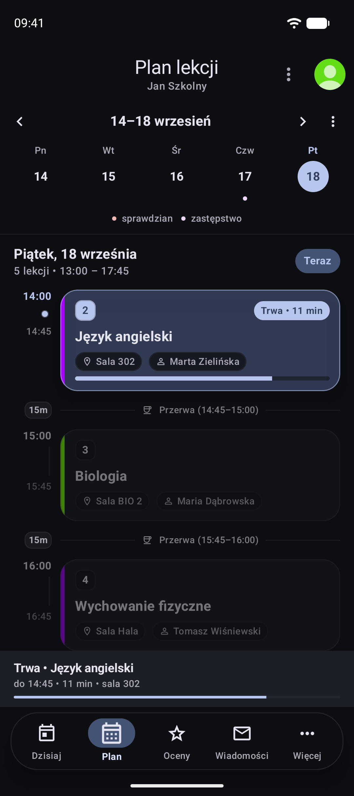
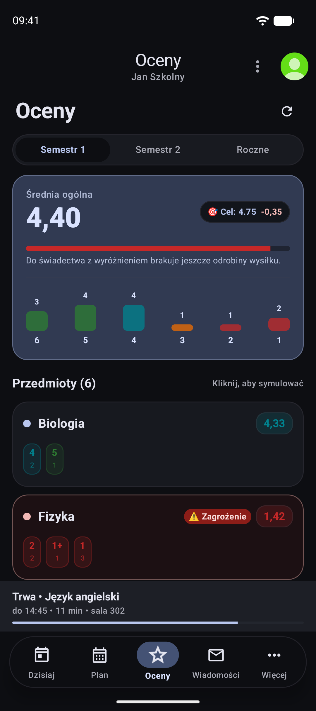
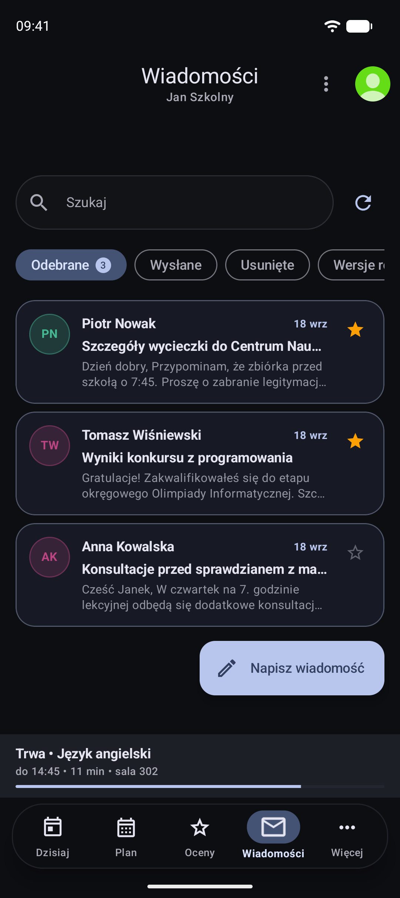

<div align="center">



# Vision

### Nowoczesny, płynny i niezależny e-Dziennik dla systemu Android
**Dopracowany fork aplikacji [Szkolny.eu](https://github.com/szkolny-eu/szkolny-android) nowej generacji**

[](https://github.com/laghert/Vision/releases/latest)
[-3DDC84?style=for-the-badge&logo=android&logoColor=white)](https://android.com)
[](https://developer.android.com/jetpack/compose)
[](LICENSE)
[](https://github.com/laghert/Vision/actions)

<p align="center">
  <a href="#-o-projekcie">O projekcie</a> •
  <a href="#-główne-nowości-i-przewagi-vision">Nowości</a> •
  <a href="#-zrzuty-ekranu">Zrzuty ekranu</a> •
  <a href="#-obsługiwane-e-dzienniki">Obsługiwane dzienniki</a> •
  <a href="#-pobieranie-i-instalacja">Pobieranie</a> •
  <a href="#-kompilacja-ze-źródeł">Kompilacja</a> •
  <a href="#-licencja-i-atrybucja">Licencja</a>
</p>

---



</div>

## 🪐 O projekcie

**Vision** to gruntownie zmodernizowany fork popularnej aplikacji **Szkolny.eu**, stworzony z myślą o uczniach i rodzicach oczekujących współczesnych standardów UX/UI, płynności działania i pełnej ergonomii na współczesnych smartfonach.

Aplikacja **Szkolny.eu** przez lata była jednym z najlepszych otwartoźródłowych rozwiązań do obsługi wielu dzienników szkolnych (m.in. Librus Synergia i Vulcan). Z czasem jednak jej interfejs zatrzymał się w epoce Material Design 2 z 2018 roku — z kłopotliwym bocznym menu szufladowym (*hamburger drawer*), sztywnymi kartami i architekturą wymagającą sięgania do górnych krawędzi dużych ekranów.

**Vision łączy to, co najlepsze z obu światów:**
1. **Stabilny fundament**: Sprawdzony, niezawodny silnik synchronizacji, obsługi wielu kont i bezpiecznej komunikacji bez pośredników z kodu Szkolny.eu.
2. **Nowoczesny interfejs 2026**: Ekrany przepisane na **Jetpack Compose**, pełne wsparcie dla **Material Design 3 (Material You)**, estetykę inspirowaną **Apple Fluid Design** oraz przemyślaną ergonomię nawigacji pod kciuk.

---

## ✨ Główne nowości i przewagi Vision

| Funkcja | Klasyczny Szkolny.eu (2018) | Vision (2026) |
| :--- | :--- | :--- |
| **Nawigacja** | Boczny drawer (wymaga sięgania do lewego górnego rogu) | **Dolny dock pod kciukiem** (Home, Plan, Oceny, Wiadomości) |
| **Technologia UI** | Tradycyjne widoki XML i przestarzały Material Design 2 | Nowoczesny **Jetpack Compose + Material You (MD3)** |
| **Fizyka i animacje** | Sztywne, skokowe przejścia | **Critically Damped Springs** – płynne przejścia oparte na fizyce |
| **Tryb ciemny** | Szary, płaski motyw ciemny | **Głęboka czerń OLED (#000000)** z wielowarstwową głębią kontenerów |
| **Kalkulator ocen** | Podstawowy podgląd średniej | **Zaawansowany symulator ocen i kalkulator celu semestralnego** |
| **Pasek bieżącej lekcji** | Zawsze widoczny, duplikujący widok | **Inteligentny `NowPlayingLessonBar`** (chowa się kontekstowo) |
| **Offline First** | Wolniejszy cache | **Lokalna baza SQLite (0.1 ms)** – 100% planu i ocen offline |
| **Prywatność** | Direct API | **100% Direct TLS 1.3** – bezpośrednie połączenie z API szkoły, 0 serwerów pośrednich |

### 🚀 Szczegółowy opis udoskonaleń:

- 📱 **Ergonomia pod jeden kciuk (Bottom Dock):**  
  Najważniejsze moduły (Strona główna, Plan lekcji, Oceny, Wiadomości, Agenda) są zawsze na wyciągnięcie kciuka.

- 🎛️ **Fizyka gestów i haptyka (Apple Fluid Motion):**  
  Animacje oparte na tłumieniu krytycznym (`DampingRatioNoBouncy`) eliminują sztuczne podskakiwanie elementów. Przejścia są natychmiastowe, przerywalne i wzbogacone o przyjemną haptykę systemową (`KEYBOARD_TAP`).

- 🌌 **OLED Tactile Hierarchy:**  
  Prawdziwa czerń `#000000` oszczędzająca baterię na ekranach AMOLED, uzupełniona o subtelne, wielopoziomowe powierzchnie (`#0D0F12`, `#14171C`, `#1C1F26`), zapewniające przejrzystość bez męczenia wzroku w nocy.

- 📊 **Symulator i kalkulator średniej:**  
  Pozwala jednym dotknięciem sprawdzić, jak hipotetyczna ocena ze sprawdzianu wpłynie na średnią ważoną i ocenę proponowaną na koniec semestru.

- 📅 **Kontekstowy pasek lekcji:**  
  Pływający pasek informujący o trwającej lub najbliższej lekcji oraz odliczaniu do dzwonka chowa się płynnie tam, gdzie te informacje są już widoczne (na ekranie głównym i w planie).

- 🔤 **Dopracowana typografia i język:**  
  Optyczny kerning/tracking, cyfry tabelaryczne o stałej szerokości w ocenach oraz poprawna polska odmiana dat (np. *14–18 września* zamiast *14-18 wrzesień*).

- 🧪 **Wbudowany tryb demonstracyjny:**  
  Możliwość natychmiastowego wypróbowania interfejsu i działania aplikacji z realistycznymi danymi testowymi bez logowania.

---

## 📸 Zrzuty ekranu

<div align="center">

| Strona Główna | Plan Lekcji |
| :---: | :---: |
|  |  |

| Oceny & Średnie | Wiadomości |
| :---: | :---: |
|  |  |

</div>

---

## 🏫 Obsługiwane e-dzienniki

Vision korzysta ze sprawdzonych modułów komunikacji z popularnymi systemami szkolnymi w Polsce:

- 🎒 **Librus Synergia** (wsparcie bezpośrednie przez API)
- 🏫 **Vulcan UONET+** (w tym obsługa nowych kont)
- 📖 **Mobidziennik**
- 👥 **Wielokontowość:** obsługa wielu uczniów i różnych platform w jednej aplikacji – idealne dla rodziców lub uczniów uczęszczających do różnych szkół.

> [!NOTE]
> Vision łączy się **bezpośrednio** z serwerami dostawcy Twojego e-dziennika (Direct API przez szyfrowane połączenie TLS 1.3). Twoje dane logowania, hasła, wiadomości i oceny nigdy nie trafiają na żadne zewnętrzne serwery twórców aplikacji.

---

## 📥 Pobieranie i instalacja

Gotowe, podpisane pakiety instalacyjne APK dostępne są w sekcji wydań:

👉 **[Pobierz najnowszą wersję APK (GitHub Releases)](https://github.com/laghert/Vision/releases/latest)**

### Wymagania systemowe:
- **System operacyjny:** Android 8.0 (Oreo, API 26) lub nowszy
- **Architektura:** ARM64 / ARMv7 / x86_64

### Instrukcja instalacji:
1. Pobierz plik `.apk` (np. `Vision-v1.0.0-beta.1.apk`) na swój telefon.
2. Otwórz pobrany plik w menedżerze plików lub przeglądarce.
3. W razie monitu systemu Android zezwól na *„Instalowanie aplikacji z nieznanych źródeł”* dla używanej przeglądarki/menedżera.
4. Zainstaluj i ciesz się nowoczesnym dziennikiem!

---

## 🛠️ Kompilacja ze źródeł

Jeśli chcesz samodzielnie zbudować aplikację lub współtworzyć kod:

### Wymagania:
- **JDK:** 17 (np. Eclipse Temurin)
- **Android Studio:** Ladybug / Jellyfish / Hedgehog lub nowsze
- **Android SDK:** `compileSdk 34`, `targetSdk 34`, `minSdk 26`

### Krok po kroku:

1. **Sklonuj repozytorium:**
   ```bash
   git clone https://github.com/laghert/Vision.git
   cd Vision
   ```

2. **Zbuduj wersję deweloperską (Debug):**
   ```bash
   ./gradlew assembleUnofficialDebug
   ```
   Plik wynikowy znajdziesz w:
   `app/build/outputs/apk/unofficial/debug/app-unofficial-debug.apk`

3. **Zbuduj zoptymalizowaną wersję produkcyjną (Release):**
   ```bash
   ./gradlew assembleUnofficialRelease
   ```
   Plik wynikowy (odchudzony przez ProGuard/R8) znajdziesz w:
   `app/build/outputs/apk/unofficial/release/`

---

## 📜 Licencja i atrybucja

Projekt **Vision** jest oprogramowaniem o otwartym kodzie źródłowym (*open-source*), dystrybuowanym na warunkach licencji **GNU General Public License v3.0 (GPLv3)**.

- **Repozytorium nadrzędne (Upstream):** [szkolny-eu/szkolny-android](https://github.com/szkolny-eu/szkolny-android)
- **Oryginalni autorzy Szkolny.eu:** Kacper Szczodrzyński oraz współtwórcy projektu Szkolny.eu.
- **Autor forka Vision:** [laghert](https://github.com/laghert) (Laghert Labs).

Zgodnie z licencją GPLv3:
- Każdy ma prawo do wglądu, modyfikacji i dalszego rozpowszechniania kodu z zachowaniem tej samej licencji oraz informacji o prawach autorskich.
- Wszelkie znaki towarowe, logotypy i nazwy dzienników (Librus, Synergia, Vulcan, Mobidziennik) należą do ich prawnych właścicieli i zostały użyte w tym repozytorium wyłącznie w celach informacyjnych i identyfikacyjnych.
- Vision jest projektem niezależnym i nieoficjalnym.

---

<div align="center">
  <sub>Stworzone z dbałością o detale przez <a href="https://github.com/laghert">Laghert Labs</a> na bazie projektu <a href="https://szkolny.eu">Szkolny.eu</a>.</sub>
</div>
